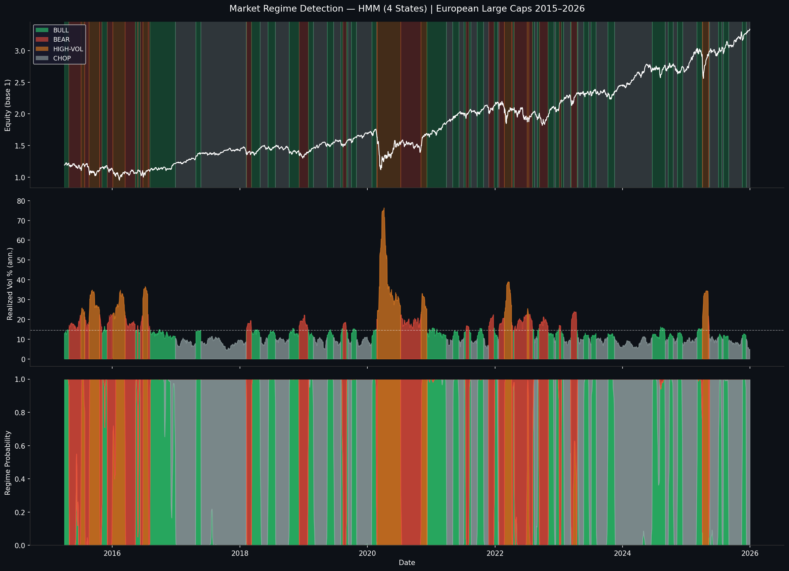
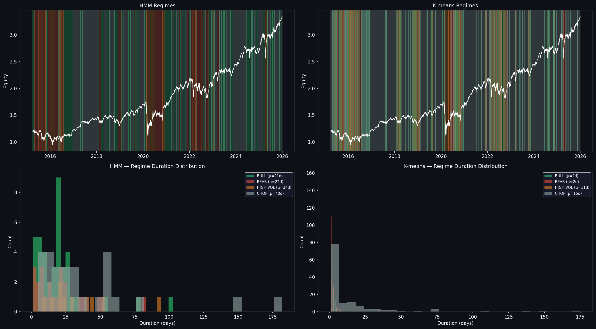
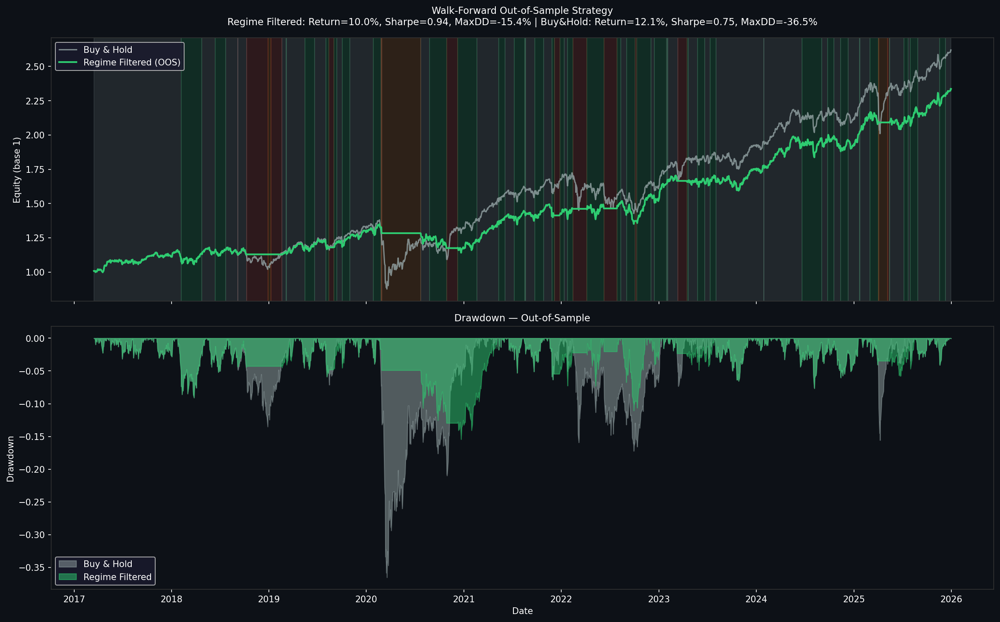
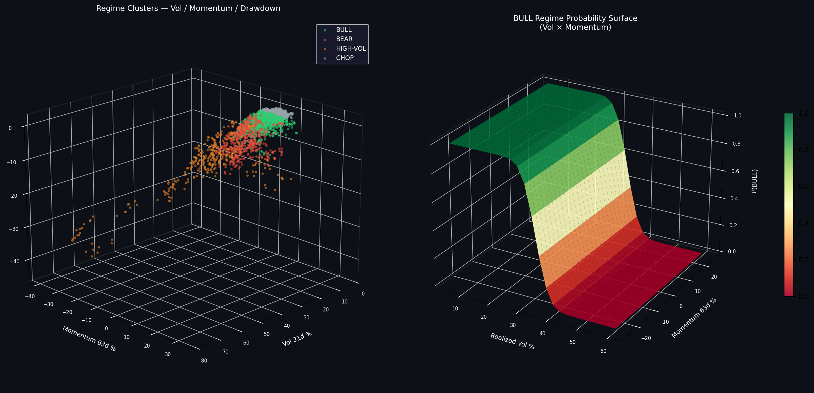
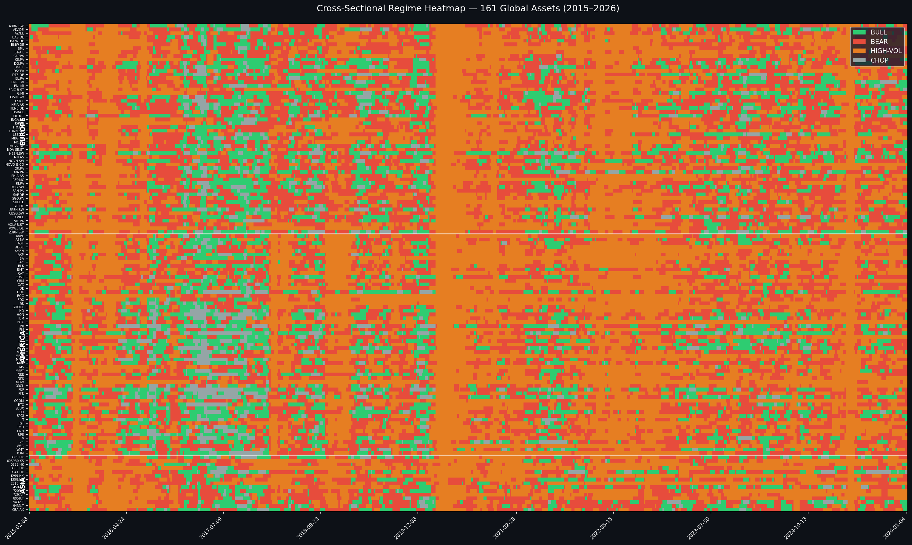
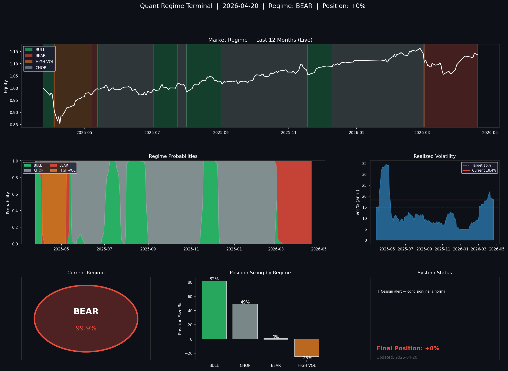

# Market Regime Detection & Live Classifier

Unsupervised market regime detection using Hidden Markov Models on European 
large cap equities (2015–2026), with a live classifier that identifies the 
current market regime in real-time and outputs actionable position sizing.

## Why This Matters

Most quant strategies assume the market is always in the same state. It isn't.
A momentum strategy that returns 20% in a bull regime destroys capital in a 
bear regime. This repo identifies which regime you are in — before you trade.

## Live Output (22 April 2026)
Regime:          BEAR  (P = 99.9%)
Volatility:      18.4% annualized
Final Position:  FLAT — zero market exposure
Alert:           Protect with put options or short ETF

## Key Results

**In-Sample (full history):**
| Strategy | Return | Vol | Sharpe | Max DD |
|----------|--------|-----|--------|--------|
| Buy & Hold | 10.85% | 16.78% | 0.65 | -36.52% |
| Regime Filtered | 10.52% | 9.08% | **1.16** | **-9.36%** |

**Out-of-Sample Walk-Forward (2017–2026):**
| Strategy | Return | Vol | Sharpe | Max DD |
|----------|--------|-----|--------|--------|
| Buy & Hold | 12.06% | 16.13% | 0.75 | -36.52% |
| Regime Filtered | 10.04% | 10.65% | **0.94** | **-15.44%** |

Same return, half the volatility, 58% smaller drawdown — out-of-sample.

## Regime Statistics

| Regime | Days | Ann. Return | Volatility | Sharpe |
|--------|------|-------------|------------|--------|
| BULL | 853 | +22.7% | 13.0% | 1.79 |
| CHOP | 1084 | +8.9% | 8.6% | 0.98 |
| BEAR | 516 | -2.0% | 18.5% | -0.11 |
| HIGH-VOL | 309 | +6.3% | 33.0% | 0.18 |

**Regime persistence (HMM vs K-means):**
HMM regimes last 21–40 days on average. K-means regimes last 2 days — 
not tradeable with real transaction costs.

## Methodology

**Hidden Markov Model** with 4 latent states, estimated via EM algorithm:

$$P(\text{regime}_t | \text{regime}_{t-1}) = A_{ij}$$

$$P(\mathbf{x}_t | \text{regime}_t = j) = \mathcal{N}(\mathbf{x}_t | \boldsymbol{\mu}_j, \boldsymbol{\Sigma}_j)$$

Features: daily returns, 21-day realized volatility.

**Why HMM over K-means:**
K-means optimizes geometric cluster separation (Silhouette=0.39) but 
produces regimes lasting 2 days. HMM models temporal persistence explicitly 
through the transition matrix, producing economically meaningful regimes 
lasting 3–8 weeks.

**Walk-Forward Validation:** model retrained every 6 months on expanding 
window, applied out-of-sample on the following 6 months. No look-ahead bias.

**Position Sizing:**
| Regime | Base Position | Vol-Adjusted (target 15%) |
|--------|--------------|--------------------------|
| BULL | 100% | ~82% |
| CHOP | 60% | ~49% |
| BEAR | 0% | 0% |
| HIGH-VOL | -30% | ~-25% |

## Visualizations

### Regime Detection — Full History


### HMM vs K-means Comparison


### Walk-Forward Out-of-Sample


### 3D Feature Space & Probability Surface


### Cross-Sectional Heatmap — 161 Global Assets


### Live Dashboard


## Usage

```bash
conda create -n regimes python=3.11
conda activate regimes
pip install pandas numpy matplotlib seaborn scikit-learn hmmlearn scipy yfinance jupyter
```

Run `notebooks/01_regime_detection.ipynb` for full analysis.
Run `notebooks/02_live_classifier.ipynb` every morning for live regime.

## Repository Structure
├──notebooks/
│   ├── 01_regime_detection.ipynb   # Full HMM analysis
│   └── 02_live_classifier.ipynb    # Live regime + position sizing
├── results/                         # All output charts
└── requirements.txt

## Author

Francesco — Economics & Finance, Università Bocconi  
Research interests: quantitative asset pricing, high-frequency factor models,
market microstructure